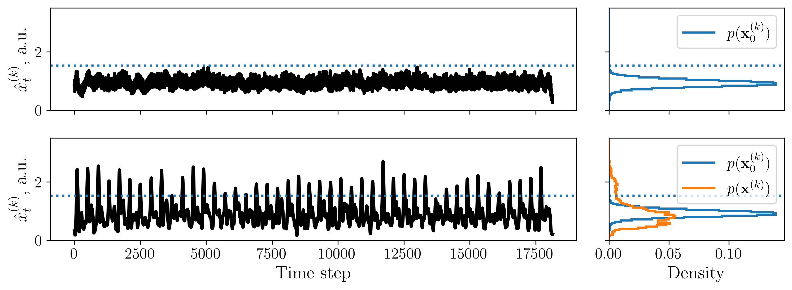

# _convSeq_: Fast and Scalable Method for Detecting Patterns in Spike Data


**PAPER:** https://arxiv.org/abs/2402.01130


## Installing dependencies

You don't have to install _all_ of the dependencies in `requirements.txt`. We just provide the package versions in case you get conflicts or other package-related issues.


## Dataset

Create a synthetic dataset. You can change the sequence parameters: number of neurons in a sequence (`seqlen`), spike dropout (`p_drop`), inter-sequence interval in timesteps (`gap_ts`) and spike timing jitter (`jitter_std`).

```bash
cd demo
python make_dataset.py \
    --seqlen 120 \
    --p_drop 0.1 \
    --gap_ts 400 \
    --jitter_std 10
```

## Filter optimization

optimize the filters for a given number of epochs:

```bash
cd demo
python demo.py --epochs 4000
```

The config is in `configs/config_demo.yaml`. When the script terminates it saves the detection results before and after optimization in the `artifacts` folder:




Also, you can make a video of the optimization progress:

```bash
cd scripts
sh make_vids.sh
```

the video will be in the `videos` folder. NOTE: Make sure you have [`ffmpeg`](https://ffmpeg.org/) and [`ffpb`](https://pypi.org/project/ffpb/) installed.
